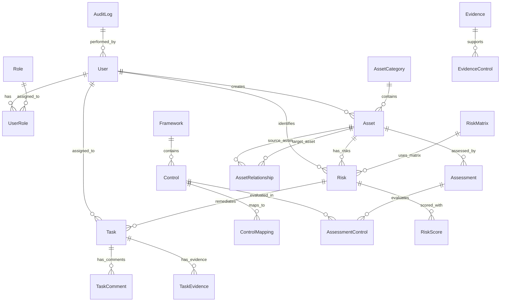

# Database Schema Documentation

## Overview

This document provides comprehensive documentation of the Aegis Risk Management Platform database schema. The database is designed to support enterprise-grade cybersecurity risk management, compliance tracking, and security assessments.

## Database Technology

- **Primary Database**: SQLite (Development) / MySQL (Production)
- **ORM**: SQLAlchemy 2.0+
- **Migration Management**: Alembic
- **Connection Pooling**: SQLAlchemy Engine with connection pooling
- **Character Set**: UTF-8
- **Timezone**: UTC timestamps with timezone awareness

## Schema Overview

The database consists of 15+ main entity groups organized into logical domains:

1. **User Management**: Users, roles, and authentication
2. **Asset Management**: Assets, categories, and relationships
3. **Risk Management**: Risks, matrices, and scoring
4. **Frameworks**: Security frameworks and controls
5. **Assessments**: Security assessments and evaluations
6. **Tasks & Remediation**: Task management and tracking
7. **Evidence**: Document and evidence management
8. **Compliance**: Compliance tracking and reporting
9. **Integration**: External system integrations
10. **Audit & Monitoring**: Activity logs and monitoring
11. **Reporting**: Report generation and templates

## Entity Relationship Diagram



## Core Tables

### User Management

#### users
User account information and profile data.

| Column | Type | Constraints | Description |
|--------|------|-------------|-------------|
| id | INTEGER | PRIMARY KEY, AUTO_INCREMENT | Unique user identifier |
| email | VARCHAR(255) | UNIQUE, NOT NULL, INDEX | User email address |
| username | VARCHAR(100) | UNIQUE, NOT NULL, INDEX | Username for login |
| full_name | VARCHAR(255) | | Full display name |
| hashed_password | VARCHAR(255) | | Bcrypt hashed password |
| is_active | BOOLEAN | DEFAULT TRUE | Account active status |
| is_verified | BOOLEAN | DEFAULT FALSE | Email verification status |
| last_login | DATETIME | | Last successful login |
| profile_picture | VARCHAR(500) | | Profile image URL |
| department | VARCHAR(100) | | User's department |
| job_title | VARCHAR(100) | | User's job title |
| phone | VARCHAR(20) | | Contact phone number |
| azure_ad_id | VARCHAR(255) | | Azure AD integration ID |
| preferences | TEXT | | JSON user preferences |
| created_at | DATETIME | NOT NULL, DEFAULT NOW() | Record creation time |
| updated_at | DATETIME | ON UPDATE NOW() | Last modification time |

#### roles
System roles and permissions.

| Column | Type | Constraints | Description |
|--------|------|-------------|-------------|
| id | INTEGER | PRIMARY KEY, AUTO_INCREMENT | Unique role identifier |
| name | VARCHAR(50) | UNIQUE, NOT NULL | Role name (Admin, Analyst, ReadOnly) |
| description | TEXT | | Role description |
| permissions | TEXT | | JSON array of permissions |
| is_active | BOOLEAN | DEFAULT TRUE | Role active status |
| created_at | DATETIME | NOT NULL, DEFAULT NOW() | Record creation time |
| updated_at | DATETIME | ON UPDATE NOW() | Last modification time |

#### user_roles
Many-to-many relationship between users and roles.

| Column | Type | Constraints | Description |
|--------|------|-------------|-------------|
| id | INTEGER | PRIMARY KEY, AUTO_INCREMENT | Unique assignment identifier |
| user_id | INTEGER | NOT NULL, FK(users.id) | Reference to user |
| role_id | INTEGER | NOT NULL, FK(roles.id) | Reference to role |
| assigned_at | DATETIME | NOT NULL, DEFAULT NOW() | Assignment timestamp |

### Asset Management

#### asset_categories
Organizational categories for assets.

| Column | Type | Constraints | Description |
|--------|------|-------------|-------------|
| id | INTEGER | PRIMARY KEY, AUTO_INCREMENT | Unique category identifier |
| name | VARCHAR(100) | NOT NULL | Category name |
| description | TEXT | | Category description |
| color | VARCHAR(7) | | Hex color code for UI |
| is_active | BOOLEAN | DEFAULT TRUE | Category active status |
| created_at | DATETIME | NOT NULL, DEFAULT NOW() | Record creation time |
| updated_at | DATETIME | ON UPDATE NOW() | Last modification time |

#### assets
Core asset inventory and information.

| Column | Type | Constraints | Description |
|--------|------|-------------|-------------|
| id | INTEGER | PRIMARY KEY, AUTO_INCREMENT | Unique asset identifier |
| name | VARCHAR(255) | NOT NULL | Asset name |
| description | TEXT | | Asset description |
| asset_type | ENUM | NOT NULL | Asset type (server, workstation, etc.) |
| criticality | ENUM | DEFAULT 'medium' | Business criticality level |
| category_id | INTEGER | FK(asset_categories.id) | Asset category reference |
| owner_id | INTEGER | FK(users.id) | Asset owner reference |
| ip_address | VARCHAR(45) | | IPv4 or IPv6 address |
| hostname | VARCHAR(255) | | Network hostname |
| operating_system | VARCHAR(100) | | OS information |
| version | VARCHAR(50) | | Software/firmware version |
| location | VARCHAR(255) | | Physical/logical location |
| environment | VARCHAR(50) | | Environment (prod/staging/dev) |
| business_unit | VARCHAR(100) | | Owning business unit |
| cost_center | VARCHAR(50) | | Cost center code |
| compliance_scope | TEXT | | JSON array of compliance frameworks |
| status | VARCHAR(50) | DEFAULT 'active' | Asset lifecycle status |
| purchase_date | DATETIME | | Purchase/deployment date |
| warranty_expiry | DATETIME | | Warranty expiration date |
| last_scan_date | DATETIME | | Last vulnerability scan |
| tags | TEXT | | JSON array of tags |
| custom_fields | TEXT | | JSON object for extensibility |
| is_active | BOOLEAN | DEFAULT TRUE | Record active status |
| created_at | DATETIME | NOT NULL, DEFAULT NOW() | Record creation time |
| updated_at | DATETIME | ON UPDATE NOW() | Last modification time |
| created_by | INTEGER | FK(users.id) | User who created record |

**Asset Type Enumeration:**
- `server`: Physical or virtual servers
- `workstation`: Desktop/laptop computers
- `network_device`: Routers, switches, firewalls
- `application`: Software applications
- `database`: Database systems
- `cloud_service`: Cloud-based services
- `mobile_device`: Mobile phones, tablets
- `iot_device`: Internet of Things devices
- `other`: Other asset types

**Asset Criticality Enumeration:**
- `low`: Low business impact
- `medium`: Moderate business impact
- `high`: High business impact
- `critical`: Mission-critical assets

#### asset_relationships
Asset dependencies and relationships.

| Column | Type | Constraints | Description |
|--------|------|-------------|-------------|
| id | INTEGER | PRIMARY KEY, AUTO_INCREMENT | Unique relationship identifier |
| source_asset_id | INTEGER | NOT NULL, FK(assets.id) | Source asset reference |
| target_asset_id | INTEGER | NOT NULL, FK(assets.id) | Target asset reference |
| relationship_type | VARCHAR(50) | NOT NULL | Relationship type |
| description | TEXT | | Relationship description |
| is_critical_dependency | BOOLEAN | DEFAULT FALSE | Critical dependency flag |
| created_at | DATETIME | NOT NULL, DEFAULT NOW() | Record creation time |
| created_by | INTEGER | FK(users.id) | User who created record |

### Risk Management

#### risk_matrices
Risk assessment matrices and scoring methodologies.

| Column | Type | Constraints | Description |
|--------|------|-------------|-------------|
| id | INTEGER | PRIMARY KEY, AUTO_INCREMENT | Unique matrix identifier |
| name | VARCHAR(100) | NOT NULL | Matrix name |
| description | TEXT | | Matrix description |
| likelihood_levels | TEXT | | JSON array of likelihood levels |
| impact_levels | TEXT | | JSON array of impact levels |
| risk_scores | TEXT | | JSON matrix of risk scores |
| risk_levels | TEXT | | JSON mapping of scores to levels |
| is_default | BOOLEAN | DEFAULT FALSE | Default matrix flag |
| is_active | BOOLEAN | DEFAULT TRUE | Matrix active status |
| created_at | DATETIME | NOT NULL, DEFAULT NOW() | Record creation time |
| updated_at | DATETIME | ON UPDATE NOW() | Last modification time |

#### risks
Risk register and risk information.

| Column | Type | Constraints | Description |
|--------|------|-------------|-------------|
| id | INTEGER | PRIMARY KEY, AUTO_INCREMENT | Unique risk identifier |
| title | VARCHAR(500) | NOT NULL | Risk title |
| description | TEXT | | Risk description |
| category | ENUM | NOT NULL | Risk category |
| subcategory | VARCHAR(100) | | Risk subcategory |
| risk_type | VARCHAR(100) | | Type (vulnerability, threat, etc.) |
| source | VARCHAR(100) | | Risk source (assessment, scan, etc.) |
| source_reference | VARCHAR(255) | | Source reference identifier |
| asset_id | INTEGER | FK(assets.id) | Associated asset |
| affected_systems | TEXT | | JSON array of affected systems |
| business_process | VARCHAR(255) | | Affected business process |
| risk_matrix_id | INTEGER | FK(risk_matrices.id) | Risk matrix reference |
| inherent_likelihood | INTEGER | | Inherent likelihood score (1-5) |
| inherent_impact | INTEGER | | Inherent impact score (1-5) |
| inherent_risk_score | FLOAT | | Calculated inherent risk score |
| residual_likelihood | INTEGER | | Residual likelihood score (1-5) |
| residual_impact | INTEGER | | Residual impact score (1-5) |
| residual_risk_score | FLOAT | | Calculated residual risk score |
| risk_level | VARCHAR(20) | | Risk level (low/medium/high/critical) |
| threat_source | VARCHAR(255) | | Threat source description |
| vulnerability | TEXT | | Vulnerability description |
| existing_controls | TEXT | | Current controls description |
| control_effectiveness | VARCHAR(50) | | Control effectiveness rating |
| ai_generated_statement | TEXT | | AI-generated risk statement |
| ai_risk_assessment | TEXT | | AI risk assessment |
| ai_confidence_score | INTEGER | | AI confidence (0-100) |
| ai_last_updated | DATETIME | | AI analysis timestamp |
| treatment_strategy | VARCHAR(50) | | Treatment approach |
| treatment_rationale | TEXT | | Treatment justification |
| status | ENUM | DEFAULT 'identified' | Risk lifecycle status |
| owner_id | INTEGER | FK(users.id) | Risk owner reference |
| identified_date | DATETIME | NOT NULL, DEFAULT NOW() | Risk identification date |
| target_resolution_date | DATETIME | | Target resolution date |
| actual_resolution_date | DATETIME | | Actual resolution date |
| last_review_date | DATETIME | | Last review date |
| next_review_date | DATETIME | | Next scheduled review |
| tags | TEXT | | JSON array of tags |
| custom_fields | TEXT | | JSON object for extensibility |
| is_active | BOOLEAN | DEFAULT TRUE | Record active status |
| created_at | DATETIME | NOT NULL, DEFAULT NOW() | Record creation time |
| updated_at | DATETIME | ON UPDATE NOW() | Last modification time |
| created_by | INTEGER | FK(users.id) | User who created record |

**Risk Category Enumeration:**
- `operational`: Operational risks
- `technical`: Technical/IT risks
- `strategic`: Strategic business risks
- `compliance`: Compliance/regulatory risks
- `financial`: Financial risks
- `reputational`: Reputation risks

**Risk Status Enumeration:**
- `identified`: Newly identified risk
- `assessed`: Risk has been assessed
- `mitigating`: Mitigation in progress
- `monitoring`: Risk being monitored
- `accepted`: Risk accepted by business
- `closed`: Risk closed/resolved

#### risk_scores
Historical risk scoring and rationale.

| Column | Type | Constraints | Description |
|--------|------|-------------|-------------|
| id | INTEGER | PRIMARY KEY, AUTO_INCREMENT | Unique score identifier |
| risk_id | INTEGER | NOT NULL, FK(risks.id) | Risk reference |
| likelihood_score | INTEGER | | Likelihood score |
| impact_score | INTEGER | | Impact score |
| total_score | FLOAT | | Total calculated score |
| risk_level | VARCHAR(20) | | Risk level |
| score_type | VARCHAR(20) | | Score type (inherent/residual) |
| likelihood_rationale | TEXT | | Likelihood justification |
| impact_rationale | TEXT | | Impact justification |
| scoring_methodology | VARCHAR(100) | | Methodology used |
| scored_by | INTEGER | FK(users.id) | User who scored |
| scored_at | DATETIME | NOT NULL, DEFAULT NOW() | Scoring timestamp |

### Framework Management

#### frameworks
Security frameworks and standards.

| Column | Type | Constraints | Description |
|--------|------|-------------|-------------|
| id | INTEGER | PRIMARY KEY, AUTO_INCREMENT | Unique framework identifier |
| name | VARCHAR(200) | NOT NULL | Framework name |
| version | VARCHAR(50) | | Framework version |
| description | TEXT | | Framework description |
| organization | VARCHAR(200) | | Publishing organization |
| framework_type | VARCHAR(100) | | Type (compliance, security, etc.) |
| publication_date | DATE | | Publication date |
| is_active | BOOLEAN | DEFAULT TRUE | Framework active status |
| created_at | DATETIME | NOT NULL, DEFAULT NOW() | Record creation time |
| updated_at | DATETIME | ON UPDATE NOW() | Last modification time |

#### controls
Individual controls within frameworks.

| Column | Type | Constraints | Description |
|--------|------|-------------|-------------|
| id | INTEGER | PRIMARY KEY, AUTO_INCREMENT | Unique control identifier |
| framework_id | INTEGER | NOT NULL, FK(frameworks.id) | Framework reference |
| control_id | VARCHAR(50) | NOT NULL | Control identifier (e.g., "AC-1") |
| title | VARCHAR(500) | NOT NULL | Control title |
| description | TEXT | | Control description |
| parent_id | INTEGER | FK(controls.id) | Parent control (for sub-controls) |
| control_type | VARCHAR(100) | | Control type/category |
| implementation_guidance | TEXT | | Implementation guidance |
| assessment_procedures | TEXT | | Assessment procedures |
| is_active | BOOLEAN | DEFAULT TRUE | Control active status |
| created_at | DATETIME | NOT NULL, DEFAULT NOW() | Record creation time |
| updated_at | DATETIME | ON UPDATE NOW() | Last modification time |

#### control_mappings
Mappings between different framework controls.

| Column | Type | Constraints | Description |
|--------|------|-------------|-------------|
| id | INTEGER | PRIMARY KEY, AUTO_INCREMENT | Unique mapping identifier |
| source_control_id | INTEGER | NOT NULL, FK(controls.id) | Source control reference |
| target_control_id | INTEGER | NOT NULL, FK(controls.id) | Target control reference |
| mapping_type | VARCHAR(50) | NOT NULL | Mapping type (exact, partial, etc.) |
| mapping_rationale | TEXT | | Mapping justification |
| confidence_level | VARCHAR(20) | | Confidence in mapping |
| created_at | DATETIME | NOT NULL, DEFAULT NOW() | Record creation time |
| created_by | INTEGER | FK(users.id) | User who created mapping |

### Assessment Management

#### assessments
Security assessments and evaluations.

| Column | Type | Constraints | Description |
|--------|------|-------------|-------------|
| id | INTEGER | PRIMARY KEY, AUTO_INCREMENT | Unique assessment identifier |
| name | VARCHAR(255) | NOT NULL | Assessment name |
| description | TEXT | | Assessment description |
| assessment_type | VARCHAR(100) | NOT NULL | Assessment type |
| framework_id | INTEGER | FK(frameworks.id) | Framework used |
| asset_id | INTEGER | FK(assets.id) | Asset being assessed |
| scope | TEXT | | Assessment scope |
| methodology | VARCHAR(100) | | Assessment methodology |
| status | VARCHAR(50) | DEFAULT 'planning' | Assessment status |
| start_date | DATETIME | | Assessment start date |
| end_date | DATETIME | | Assessment end date |
| due_date | DATETIME | | Assessment due date |
| assessor_internal | INTEGER | FK(users.id) | Internal assessor |
| assessor_external | VARCHAR(255) | | External assessor |
| overall_score | FLOAT | | Overall assessment score |
| risk_rating | VARCHAR(20) | | Overall risk rating |
| executive_summary | TEXT | | Executive summary |
| recommendations | TEXT | | Assessment recommendations |
| ai_generated_summary | TEXT | | AI-generated summary |
| ai_confidence_score | INTEGER | | AI confidence (0-100) |
| is_active | BOOLEAN | DEFAULT TRUE | Record active status |
| created_at | DATETIME | NOT NULL, DEFAULT NOW() | Record creation time |
| updated_at | DATETIME | ON UPDATE NOW() | Last modification time |
| created_by_id | INTEGER | FK(users.id) | User who created assessment |

#### assessment_controls
Control evaluations within assessments.

| Column | Type | Constraints | Description |
|--------|------|-------------|-------------|
| id | INTEGER | PRIMARY KEY, AUTO_INCREMENT | Unique evaluation identifier |
| assessment_id | INTEGER | NOT NULL, FK(assessments.id) | Assessment reference |
| control_id | INTEGER | NOT NULL, FK(controls.id) | Control reference |
| implementation_status | VARCHAR(50) | NOT NULL | Implementation status |
| effectiveness_rating | VARCHAR(20) | | Effectiveness rating |
| maturity_level | INTEGER | | Maturity level (1-5) |
| findings | TEXT | | Assessment findings |
| recommendations | TEXT | | Control recommendations |
| evidence_notes | TEXT | | Evidence description |
| tested_by | INTEGER | FK(users.id) | User who tested |
| tested_date | DATETIME | | Testing date |
| ai_assessment | TEXT | | AI-generated assessment |
| ai_confidence_score | INTEGER | | AI confidence (0-100) |
| created_at | DATETIME | NOT NULL, DEFAULT NOW() | Record creation time |
| updated_at | DATETIME | ON UPDATE NOW() | Last modification time |

### Task Management

#### tasks
Task and remediation tracking.

| Column | Type | Constraints | Description |
|--------|------|-------------|-------------|
| id | INTEGER | PRIMARY KEY, AUTO_INCREMENT | Unique task identifier |
| title | VARCHAR(500) | NOT NULL | Task title |
| description | TEXT | | Task description |
| task_type | VARCHAR(50) | NOT NULL | Task type |
| priority | VARCHAR(20) | DEFAULT 'medium' | Task priority |
| status | VARCHAR(50) | DEFAULT 'open' | Task status |
| progress_percentage | INTEGER | DEFAULT 0 | Completion percentage |
| risk_id | INTEGER | FK(risks.id) | Associated risk |
| assessment_id | INTEGER | FK(assessments.id) | Associated assessment |
| asset_id | INTEGER | FK(assets.id) | Associated asset |
| control_id | INTEGER | FK(controls.id) | Associated control |
| assigned_to_id | INTEGER | FK(users.id) | Assignee reference |
| created_by_id | INTEGER | FK(users.id) | Creator reference |
| due_date | DATETIME | | Task due date |
| start_date | DATETIME | | Task start date |
| completed_date | DATETIME | | Task completion date |
| estimated_hours | INTEGER | | Estimated effort hours |
| actual_hours | INTEGER | | Actual effort hours |
| tags | TEXT | | JSON array of tags |
| custom_fields | TEXT | | JSON object for extensibility |
| is_active | BOOLEAN | DEFAULT TRUE | Record active status |
| created_at | DATETIME | NOT NULL, DEFAULT NOW() | Record creation time |
| updated_at | DATETIME | ON UPDATE NOW() | Last modification time |

#### task_comments
Task discussion and updates.

| Column | Type | Constraints | Description |
|--------|------|-------------|-------------|
| id | INTEGER | PRIMARY KEY, AUTO_INCREMENT | Unique comment identifier |
| task_id | INTEGER | NOT NULL, FK(tasks.id) | Task reference |
| comment | TEXT | NOT NULL | Comment content |
| comment_type | VARCHAR(50) | DEFAULT 'comment' | Comment type |
| is_internal | BOOLEAN | DEFAULT TRUE | Internal comment flag |
| created_by | INTEGER | NOT NULL, FK(users.id) | Comment author |
| created_at | DATETIME | NOT NULL, DEFAULT NOW() | Record creation time |
| updated_at | DATETIME | ON UPDATE NOW() | Last modification time |

#### task_evidence
Evidence attachments for tasks.

| Column | Type | Constraints | Description |
|--------|------|-------------|-------------|
| id | INTEGER | PRIMARY KEY, AUTO_INCREMENT | Unique evidence identifier |
| task_id | INTEGER | NOT NULL, FK(tasks.id) | Task reference |
| evidence_id | INTEGER | NOT NULL, FK(evidence.id) | Evidence reference |
| relationship_type | VARCHAR(50) | | Evidence relationship type |
| notes | TEXT | | Relationship notes |
| created_by | INTEGER | FK(users.id) | User who linked evidence |
| created_at | DATETIME | NOT NULL, DEFAULT NOW() | Record creation time |

### Evidence Management

#### evidence
Document and evidence repository.

| Column | Type | Constraints | Description |
|--------|------|-------------|-------------|
| id | INTEGER | PRIMARY KEY, AUTO_INCREMENT | Unique evidence identifier |
| title | VARCHAR(500) | NOT NULL | Evidence title |
| description | TEXT | | Evidence description |
| evidence_type | VARCHAR(100) | NOT NULL | Evidence type |
| category | VARCHAR(100) | | Evidence category |
| file_path | VARCHAR(1000) | | File storage path |
| file_name | VARCHAR(500) | | Original filename |
| file_size | BIGINT | | File size in bytes |
| file_type | VARCHAR(100) | | MIME type |
| file_hash | VARCHAR(256) | | File integrity hash |
| source_system | VARCHAR(100) | | Source system |
| collection_date | DATETIME | | Evidence collection date |
| retention_date | DATETIME | | Retention expiry date |
| sensitivity_level | VARCHAR(50) | | Data sensitivity level |
| access_restrictions | TEXT | | Access control notes |
| metadata | TEXT | | JSON metadata |
| tags | TEXT | | JSON array of tags |
| ai_analysis | TEXT | | AI-generated analysis |
| ai_confidence_score | INTEGER | | AI confidence (0-100) |
| ai_last_analyzed | DATETIME | | AI analysis timestamp |
| is_active | BOOLEAN | DEFAULT TRUE | Record active status |
| created_at | DATETIME | NOT NULL, DEFAULT NOW() | Record creation time |
| updated_at | DATETIME | ON UPDATE NOW() | Last modification time |
| uploaded_by | INTEGER | FK(users.id) | User who uploaded |

#### evidence_controls
Evidence supporting control implementations.

| Column | Type | Constraints | Description |
|--------|------|-------------|-------------|
| id | INTEGER | PRIMARY KEY, AUTO_INCREMENT | Unique link identifier |
| evidence_id | INTEGER | NOT NULL, FK(evidence.id) | Evidence reference |
| control_id | INTEGER | NOT NULL, FK(controls.id) | Control reference |
| support_type | VARCHAR(50) | | How evidence supports control |
| adequacy_rating | VARCHAR(20) | | Evidence adequacy rating |
| notes | TEXT | | Support relationship notes |
| created_by | INTEGER | FK(users.id) | User who linked |
| created_at | DATETIME | NOT NULL, DEFAULT NOW() | Record creation time |

### Integration & External Data

#### integrations
External system integrations.

| Column | Type | Constraints | Description |
|--------|------|-------------|-------------|
| id | INTEGER | PRIMARY KEY, AUTO_INCREMENT | Unique integration identifier |
| name | VARCHAR(200) | NOT NULL | Integration name |
| integration_type | VARCHAR(100) | NOT NULL | Integration type |
| description | TEXT | | Integration description |
| endpoint_url | VARCHAR(1000) | | API endpoint URL |
| authentication_type | VARCHAR(50) | | Auth type (api_key, oauth, etc.) |
| configuration | TEXT | | JSON configuration |
| sync_frequency | VARCHAR(50) | | Sync frequency |
| last_sync | DATETIME | | Last successful sync |
| last_error | TEXT | | Last error message |
| is_active | BOOLEAN | DEFAULT TRUE | Integration active status |
| created_at | DATETIME | NOT NULL, DEFAULT NOW() | Record creation time |
| updated_at | DATETIME | ON UPDATE NOW() | Last modification time |
| created_by | INTEGER | FK(users.id) | User who created |

#### vulnerability_data
Vulnerability scan data from external tools.

| Column | Type | Constraints | Description |
|--------|------|-------------|-------------|
| id | INTEGER | PRIMARY KEY, AUTO_INCREMENT | Unique vulnerability identifier |
| asset_id | INTEGER | FK(assets.id) | Associated asset |
| integration_id | INTEGER | FK(integrations.id) | Source integration |
| vulnerability_id | VARCHAR(100) | NOT NULL | External vulnerability ID |
| cve_id | VARCHAR(50) | | CVE identifier |
| title | VARCHAR(500) | NOT NULL | Vulnerability title |
| description | TEXT | | Vulnerability description |
| severity | VARCHAR(20) | | Severity level |
| cvss_score | FLOAT | | CVSS base score |
| cvss_vector | VARCHAR(100) | | CVSS vector string |
| solution | TEXT | | Remediation solution |
| first_detected | DATETIME | | First detection date |
| last_detected | DATETIME | | Last detection date |
| status | VARCHAR(50) | | Vulnerability status |
| raw_data | TEXT | | JSON raw scan data |
| created_at | DATETIME | NOT NULL, DEFAULT NOW() | Record creation time |
| updated_at | DATETIME | ON UPDATE NOW() | Last modification time |

#### threat_intel_data
Threat intelligence data from external feeds.

| Column | Type | Constraints | Description |
|--------|------|-------------|-------------|
| id | INTEGER | PRIMARY KEY, AUTO_INCREMENT | Unique threat identifier |
| integration_id | INTEGER | FK(integrations.id) | Source integration |
| threat_id | VARCHAR(200) | NOT NULL | External threat ID |
| threat_type | VARCHAR(100) | | Threat type |
| title | VARCHAR(500) | NOT NULL | Threat title |
| description | TEXT | | Threat description |
| severity | VARCHAR(20) | | Threat severity |
| confidence | VARCHAR(20) | | Intelligence confidence |
| tlp_classification | VARCHAR(20) | | TLP classification |
| iocs | TEXT | | JSON indicators of compromise |
| tactics | TEXT | | JSON MITRE ATT&CK tactics |
| techniques | TEXT | | JSON MITRE ATT&CK techniques |
| first_seen | DATETIME | | First seen timestamp |
| last_updated | DATETIME | | Last update timestamp |
| expiry_date | DATETIME | | Intelligence expiry date |
| raw_data | TEXT | | JSON raw intelligence data |
| created_at | DATETIME | NOT NULL, DEFAULT NOW() | Record creation time |
| updated_at | DATETIME | ON UPDATE NOW() | Last modification time |

### Audit & Monitoring

#### audit_logs
System activity and audit trail.

| Column | Type | Constraints | Description |
|--------|------|-------------|-------------|
| id | INTEGER | PRIMARY KEY, AUTO_INCREMENT | Unique audit identifier |
| user_id | INTEGER | FK(users.id) | User performing action |
| action | VARCHAR(100) | NOT NULL | Action performed |
| resource_type | VARCHAR(100) | | Resource type affected |
| resource_id | INTEGER | | Resource ID affected |
| old_values | TEXT | | JSON previous values |
| new_values | TEXT | | JSON new values |
| ip_address | VARCHAR(45) | | Source IP address |
| user_agent | VARCHAR(500) | | User agent string |
| session_id | VARCHAR(255) | | Session identifier |
| request_id | VARCHAR(255) | | Request correlation ID |
| outcome | VARCHAR(20) | DEFAULT 'success' | Action outcome |
| error_message | TEXT | | Error details if failed |
| created_at | DATETIME | NOT NULL, DEFAULT NOW() | Record creation time |

### Reporting

#### report_templates
Report templates and configurations.

| Column | Type | Constraints | Description |
|--------|------|-------------|-------------|
| id | INTEGER | PRIMARY KEY, AUTO_INCREMENT | Unique template identifier |
| name | VARCHAR(255) | NOT NULL | Template name |
| description | TEXT | | Template description |
| report_type | VARCHAR(100) | NOT NULL | Report type |
| template_data | TEXT | | JSON template configuration |
| parameters | TEXT | | JSON parameter definitions |
| output_formats | TEXT | | JSON supported output formats |
| is_default | BOOLEAN | DEFAULT FALSE | Default template flag |
| is_active | BOOLEAN | DEFAULT TRUE | Template active status |
| created_at | DATETIME | NOT NULL, DEFAULT NOW() | Record creation time |
| updated_at | DATETIME | ON UPDATE NOW() | Last modification time |
| created_by | INTEGER | FK(users.id) | User who created template |

#### reports
Generated reports and their metadata.

| Column | Type | Constraints | Description |
|--------|------|-------------|-------------|
| id | INTEGER | PRIMARY KEY, AUTO_INCREMENT | Unique report identifier |
| template_id | INTEGER | FK(report_templates.id) | Template used |
| name | VARCHAR(255) | NOT NULL | Report name |
| description | TEXT | | Report description |
| report_type | VARCHAR(100) | NOT NULL | Report type |
| parameters | TEXT | | JSON generation parameters |
| file_path | VARCHAR(1000) | | Generated file path |
| file_format | VARCHAR(50) | | Output format |
| file_size | BIGINT | | File size in bytes |
| generation_status | VARCHAR(50) | DEFAULT 'pending' | Generation status |
| generation_started | DATETIME | | Generation start time |
| generation_completed | DATETIME | | Generation completion time |
| generation_error | TEXT | | Error message if failed |
| generated_by | INTEGER | FK(users.id) | User who generated |
| scheduled_id | VARCHAR(255) | | Scheduled report ID |
| retention_date | DATETIME | | Report retention expiry |
| access_count | INTEGER | DEFAULT 0 | Access counter |
| last_accessed | DATETIME | | Last access timestamp |
| is_active | BOOLEAN | DEFAULT TRUE | Record active status |
| created_at | DATETIME | NOT NULL, DEFAULT NOW() | Record creation time |
| updated_at | DATETIME | ON UPDATE NOW() | Last modification time |

## Indexes and Performance

### Primary Indexes
All tables have primary key indexes on their `id` columns.

### Secondary Indexes

#### User Management
```sql
CREATE INDEX idx_users_email ON users(email);
CREATE INDEX idx_users_username ON users(username);
CREATE INDEX idx_users_is_active ON users(is_active);
CREATE INDEX idx_user_roles_user_id ON user_roles(user_id);
CREATE INDEX idx_user_roles_role_id ON user_roles(role_id);
```

#### Asset Management
```sql
CREATE INDEX idx_assets_name ON assets(name);
CREATE INDEX idx_assets_asset_type ON assets(asset_type);
CREATE INDEX idx_assets_criticality ON assets(criticality);
CREATE INDEX idx_assets_category_id ON assets(category_id);
CREATE INDEX idx_assets_owner_id ON assets(owner_id);
CREATE INDEX idx_assets_is_active ON assets(is_active);
CREATE INDEX idx_assets_created_at ON assets(created_at);
```

#### Risk Management
```sql
CREATE INDEX idx_risks_title ON risks(title);
CREATE INDEX idx_risks_category ON risks(category);
CREATE INDEX idx_risks_status ON risks(status);
CREATE INDEX idx_risks_asset_id ON risks(asset_id);
CREATE INDEX idx_risks_owner_id ON risks(owner_id);
CREATE INDEX idx_risks_risk_level ON risks(risk_level);
CREATE INDEX idx_risks_identified_date ON risks(identified_date);
```

#### Framework Management
```sql
CREATE INDEX idx_controls_framework_id ON controls(framework_id);
CREATE INDEX idx_controls_control_id ON controls(control_id);
CREATE INDEX idx_controls_parent_id ON controls(parent_id);
```

#### Assessment Management
```sql
CREATE INDEX idx_assessments_asset_id ON assessments(asset_id);
CREATE INDEX idx_assessments_framework_id ON assessments(framework_id);
CREATE INDEX idx_assessments_status ON assessments(status);
CREATE INDEX idx_assessments_created_by_id ON assessments(created_by_id);
CREATE INDEX idx_assessment_controls_assessment_id ON assessment_controls(assessment_id);
CREATE INDEX idx_assessment_controls_control_id ON assessment_controls(control_id);
```

#### Task Management
```sql
CREATE INDEX idx_tasks_assigned_to_id ON tasks(assigned_to_id);
CREATE INDEX idx_tasks_created_by_id ON tasks(created_by_id);
CREATE INDEX idx_tasks_risk_id ON tasks(risk_id);
CREATE INDEX idx_tasks_status ON tasks(status);
CREATE INDEX idx_tasks_priority ON tasks(priority);
CREATE INDEX idx_tasks_due_date ON tasks(due_date);
```

#### Audit Logging
```sql
CREATE INDEX idx_audit_logs_user_id ON audit_logs(user_id);
CREATE INDEX idx_audit_logs_action ON audit_logs(action);
CREATE INDEX idx_audit_logs_resource_type ON audit_logs(resource_type);
CREATE INDEX idx_audit_logs_created_at ON audit_logs(created_at);
```

### Composite Indexes

```sql
-- Asset lookups
CREATE INDEX idx_assets_type_criticality ON assets(asset_type, criticality);
CREATE INDEX idx_assets_category_status ON assets(category_id, status);

-- Risk analysis
CREATE INDEX idx_risks_status_level ON risks(status, risk_level);
CREATE INDEX idx_risks_asset_category ON risks(asset_id, category);

-- Task management
CREATE INDEX idx_tasks_assignee_status ON tasks(assigned_to_id, status);
CREATE INDEX idx_tasks_priority_due_date ON tasks(priority, due_date);

-- Assessment tracking
CREATE INDEX idx_assessments_type_status ON assessments(assessment_type, status);
CREATE INDEX idx_assessment_controls_status ON assessment_controls(assessment_id, implementation_status);
```

## Data Constraints

### Foreign Key Constraints
All foreign key relationships are enforced at the database level with appropriate CASCADE options:

- **ON DELETE CASCADE**: Applied to dependent records (comments, evidence links)
- **ON DELETE RESTRICT**: Applied to core references (asset owners, risk owners)
- **ON DELETE SET NULL**: Applied to optional references

### Check Constraints

```sql
-- User constraints
ALTER TABLE users ADD CONSTRAINT chk_email_format CHECK (email REGEXP '^[A-Za-z0-9._%+-]+@[A-Za-z0-9.-]+\.[A-Za-z]{2,}$');
ALTER TABLE users ADD CONSTRAINT chk_username_length CHECK (LENGTH(username) >= 3);

-- Asset constraints
ALTER TABLE assets ADD CONSTRAINT chk_ip_address_format CHECK (ip_address IS NULL OR ip_address REGEXP '^[0-9]{1,3}\.[0-9]{1,3}\.[0-9]{1,3}\.[0-9]{1,3}$');
ALTER TABLE assets ADD CONSTRAINT chk_criticality_valid CHECK (criticality IN ('low', 'medium', 'high', 'critical'));

-- Risk constraints
ALTER TABLE risks ADD CONSTRAINT chk_likelihood_range CHECK (inherent_likelihood BETWEEN 1 AND 5);
ALTER TABLE risks ADD CONSTRAINT chk_impact_range CHECK (inherent_impact BETWEEN 1 AND 5);
ALTER TABLE risks ADD CONSTRAINT chk_risk_score_positive CHECK (inherent_risk_score >= 0);

-- Task constraints
ALTER TABLE tasks ADD CONSTRAINT chk_progress_percentage CHECK (progress_percentage BETWEEN 0 AND 100);
ALTER TABLE tasks ADD CONSTRAINT chk_priority_valid CHECK (priority IN ('low', 'medium', 'high', 'critical'));
```

## Data Types and Storage

### Text Field Specifications
- **VARCHAR(50)**: Short identifiers, status values
- **VARCHAR(100)**: Names, categories, moderate text
- **VARCHAR(255)**: Longer names, file paths, URLs
- **VARCHAR(500)**: Titles, longer descriptive text
- **VARCHAR(1000)**: File paths, URLs with parameters
- **TEXT**: Long descriptions, JSON data, content

### JSON Field Usage
Several fields store JSON data for flexibility:
- `preferences` (users): User interface preferences
- `permissions` (roles): Array of permission strings
- `tags` (multiple tables): Array of tag strings
- `custom_fields` (multiple tables): Extensible field data
- `compliance_scope` (assets): Array of compliance frameworks
- `configuration` (integrations): Integration-specific settings

### Date/Time Handling
- All timestamps use `DATETIME` with timezone support
- `created_at` fields default to current timestamp
- `updated_at` fields auto-update on record modification
- Business dates (due dates, expiry dates) stored without timezone

## Migration Strategy

### Schema Evolution
Database schema changes are managed through Alembic migrations:

1. **Development**: Generate migration scripts automatically
2. **Testing**: Run migrations in test environments
3. **Production**: Execute migrations during maintenance windows

### Migration File Examples

#### Adding New Column
```python
# Migration: Add ai_confidence_score to risks table
def upgrade():
    op.add_column('risks', sa.Column('ai_confidence_score', sa.Integer))
    
def downgrade():
    op.drop_column('risks', 'ai_confidence_score')
```

#### Adding New Table
```python
# Migration: Add compliance_reports table
def upgrade():
    op.create_table('compliance_reports',
        sa.Column('id', sa.Integer, primary_key=True),
        sa.Column('name', sa.String(255), nullable=False),
        sa.Column('framework_id', sa.Integer, sa.ForeignKey('frameworks.id')),
        sa.Column('generated_at', sa.DateTime, server_default=sa.func.now())
    )
    
def downgrade():
    op.drop_table('compliance_reports')
```

#### Data Migration
```python
# Migration: Populate default risk matrix
def upgrade():
    connection = op.get_bind()
    connection.execute(
        text("""
        INSERT INTO risk_matrices (name, description, is_default)
        VALUES ('Standard 5x5', 'Standard 5x5 risk assessment matrix', true)
        """)
    )
    
def downgrade():
    connection = op.get_bind()
    connection.execute(
        text("DELETE FROM risk_matrices WHERE name = 'Standard 5x5'")
    )
```

## Security Considerations

### Data Protection
- Passwords stored as bcrypt hashes
- Sensitive data encrypted at rest
- PII fields identified and protected
- Audit trail for all data modifications

### Access Control
- Row-level security through application logic
- Role-based permissions enforced
- API key and session management
- Data classification and handling

### Compliance
- GDPR compliance considerations
- SOX audit trail requirements
- HIPAA data handling (if applicable)
- Data retention and purging policies

## Backup and Recovery

### Backup Strategy
- **Full Backup**: Daily during low-usage periods
- **Incremental Backup**: Every 6 hours
- **Transaction Log Backup**: Every 15 minutes
- **Point-in-Time Recovery**: Available for last 30 days

### Recovery Procedures
1. **Database Corruption**: Restore from most recent full backup
2. **Data Loss**: Point-in-time recovery to before incident
3. **Disaster Recovery**: Failover to standby database
4. **Testing**: Monthly recovery testing procedures

## Monitoring and Maintenance

### Performance Monitoring
- Query execution time monitoring
- Index usage analysis
- Table size and growth tracking
- Connection pool monitoring

### Maintenance Tasks
- **Weekly**: Index reorganization
- **Monthly**: Statistics updates
- **Quarterly**: Full database integrity check
- **Annually**: Storage optimization

### Alert Thresholds
- Query execution time > 10 seconds
- Database size growth > 20% per month
- Failed backup attempts
- Excessive lock contention

## Conclusion

This database schema provides a comprehensive foundation for enterprise cybersecurity risk management. The design emphasizes:

- **Scalability**: Proper indexing and normalization
- **Flexibility**: JSON fields for extensibility
- **Integrity**: Foreign key constraints and data validation
- **Auditability**: Complete audit trail and versioning
- **Performance**: Optimized indexes and query patterns
- **Security**: Data protection and access controls

For questions about the schema or to request changes, please refer to the database administrator or create an issue in the project repository.